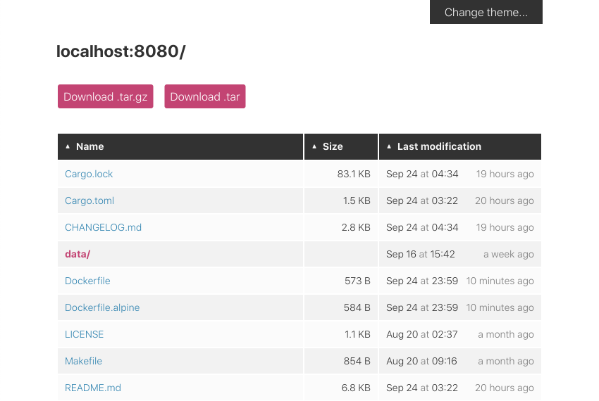

<p align="center">
  <br>
</p>

# miniserve - a CLI tool to serve files and dirs over HTTP

[](https://github.com/svenstaro/miniserve/actions)
[](https://cloud.docker.com/repository/docker/svenstaro/miniserve/)
[](https://crates.io/crates/miniserve)
[](https://github.com/svenstaro/miniserve/blob/master/LICENSE)
[](https://github.com/svenstaro/miniserve/stargazers)
[](https://github.com/svenstaro/miniserve/releases)
[](https://github.com/svenstaro/miniserve)

**For when you really just want to serve some files over HTTP right now!**

**miniserve** is a small, self-contained cross-platform CLI tool that allows you to just grab the binary and serve some file(s) via HTTP.
Sometimes this is just a more practical and quick way than doing things properly.

## Screenshot



## How to use

### Serve a directory:

    miniserve linux-distro-collection/

### Serve a single file:

    miniserve linux-distro.iso

### Set a custom index file to serve instead of a file listing:

    miniserve --index test.html

### Serve an SPA (Single Page Application) so that non-existent paths are forwarded to the SPA's router instead

    miniserve --spa --index index.html

### Require username/password:

    miniserve --auth joe:123 unreleased-linux-distros/

### Require username/password as hash:

    pw=$(echo -n "123" | sha256sum | cut -f 1 -d ' ')
    miniserve --auth joe:sha256:$pw unreleased-linux-distros/

### Require username/password from file (separate logins with new lines):

    miniserve --auth-file auth.txt unreleased-linux-distros/

### Generate random 6-hexdigit URL:

    miniserve -i 192.168.0.1 --random-route /tmp
    # Serving path /private/tmp at http://192.168.0.1/c789b6

### Bind to multiple interfaces:

    miniserve -i 192.168.0.1 -i 10.13.37.10 -i ::1 /tmp/myshare

### Insert custom headers

    miniserve --header "Cache-Control:no-cache" --header "X-Custom-Header:custom-value" -p 8080 /tmp/myshare
    # Check headers in another terminal
    curl -I http://localhost:8080

If a header is already set or previously inserted, it will not be overwritten.

### Start with TLS:

    miniserve --tls-cert my.cert --tls-key my.key /tmp/myshare
    # Fullchain TLS and HTTP Strict Transport Security (HSTS)
    miniserve --tls-cert fullchain.pem --tls-key my.key --header "Strict-Transport-Security: max-age=31536000; includeSubDomains; preload" /tmp/myshare

If the parameter value has spaces, be sure to wrap it in quotes.
(To achieve an A+ rating at https://www.ssllabs.com/ssltest/, enabling both fullchain TLS and HSTS is necessary.)

### Upload a file using `curl`:

    # in one terminal
    miniserve -u -- .
    # in another terminal
    curl -F "path=@$FILE" http://localhost:8080/upload\?path\=/

(where `$FILE` is the path to the file. This uses miniserve's default port of 8080)

Note that for uploading, we have to use `--` to disambiguate the argument to `-u`.
This is because `-u` can also take a path (or multiple). If a path argument to `-u` is given,
uploading will only be possible to the provided paths as opposed to every path.

Another effect of this is that you can't just combine flags like this `-uv` when `-u` is used. In
this example, you'd need to use `-u -v`.

### Create a directory using `curl`:

    # in one terminal
    miniserve --upload-files --mkdir .
    # in another terminal
    curl -F "mkdir=$DIR_NAME" http://localhost:8080/upload\?path=\/

(where `$DIR_NAME` is the name of the directory. This uses miniserve's default port of 8080.)

### Use the raw renderer for use with simple viewers

You can pass `?raw=true` with requests where you only require minimal HTML output for CLI-based browsers such as `lynx` or `w3m`.
This is enabled by default without any extra flags:

    miniserve .
    curl http://localhost:8080?raw=true

You can enable a convenient copy-pastable footer for `wget` using `--show-wget-footer`:

    miniserve --show-wget-footer .

Afterwards, check the bottom of any rendered page.
It'll have a neat `wget` command you can easily copy-paste to recursively grab the current directory.

### Take pictures and upload them from smartphones:

    miniserve -u -m image -q

This uses the `--media-type` option, which sends a hint for the expected media type to the browser.
Some mobile browsers like Firefox on Android will offer to open the camera app when seeing this.

## Features

- Easy to use
- Just works: Correct MIME types handling out of the box
- Single binary drop-in with no extra dependencies required
- Authentication support with username and password (and hashed password)
- Mega fast and highly parallel (thanks to [Rust](https://www.rust-lang.org/) and [Actix](https://actix.rs/))
- Folder download (compressed on the fly as `.tar.gz` or `.zip`)
- File uploading
- Directory creation
- Pretty themes (with light and dark theme support)
- Scan QR code for quick access
- Shell completions
- Sane and secure defaults
- TLS (for supported architectures)
- Supports README.md rendering like on GitHub
- Range requests
- WebDAV support
- Healthcheck route (at `/__miniserve_internal/healthcheck`)

## Usage

```
For when you really just want to serve some files over HTTP right now!

Usage: miniserve [OPTIONS] [PATH]

Arguments:
  [PATH]
          Which path to serve

          [env: MINISERVE_PATH=]

Options:
  -v, --verbose
          Be verbose, includes emitting access logs

          [env: MINISERVE_VERBOSE=]

      --index <INDEX>
          The name of a directory index file to serve, like "index.html"

          Normally, when miniserve serves a directory, it creates a listing for that directory. However, if a
          directory contains this file, miniserve will serve that file instead.

          [env: MINISERVE_INDEX=]

      --spa
          Activate SPA (Single Page Application) mode

          This will cause the file given by --index to be served for all non-existing file paths. In effect,
          this will serve the index file whenever a 404 would otherwise occur in order to allow the SPA
          router to handle the request instead.

          [env: MINISERVE_SPA=]

      --pretty-urls
          Activate Pretty URLs mode

          This will cause the server to serve the equivalent `.html` file indicated by the path.

          `/about` will try to find `about.html` and serve it.

          [env: MINISERVE_PRETTY_URLS=]

  -p, --port <PORT>
          Port to use

          [env: MINISERVE_PORT=]
          [default: 8080]

  -i, --interfaces <INTERFACES>
          Interface to listen on

          [env: MINISERVE_INTERFACE=]

  -a, --auth <AUTH>
          Set authentication

          Currently supported formats:
          username:password, username:sha256:hash, username:sha512:hash
          (e.g. joe:123, joe:sha256:a665a45920422f9d417e4867efdc4fb8a04a1f3fff1fa07e998e86f7f7a27ae3)

          [env: MINISERVE_AUTH=]

      --auth-file <AUTH_FILE>
          Read authentication values from a file

          Example file content:

          joe:123
          bob:sha256:a665a45920422f9d417e4867efdc4fb8a04a1f3fff1fa07e998e86f7f7a27ae3
          bill:

          [env: MINISERVE_AUTH_FILE=]

      --route-prefix <ROUTE_PREFIX>
          Use a specific route prefix

          [env: MINISERVE_ROUTE_PREFIX=]

      --random-route
          Generate a random 6-hexdigit route

          [env: MINISERVE_RANDOM_ROUTE=]

      --file-external-url <FILE_BASE_URL>
          Optional external URL (e.g., 'http://external.example.com:8081') prepended to file links in listings.
          Allows serving files from a different URL than the browsing instance. Useful for setups like:
          one authenticated instance for browsing, linking files (via this option) to a second,
          non-indexed (-I) instance for direct downloads. This obscures the full file list on
          the download server, while users can still copy direct file URLs for sharing.
          The external URL is put verbatim in front of the relative location of the file, including the protocol.
          The user should take care this results in a valid URL, no further checks are being done.
      
          [env: MINISERVE_FILE_EXTERNAL_URL=]

  -P, --no-symlinks
          Hide symlinks in listing and prevent them from being followed

          [env: MINISERVE_NO_SYMLINKS=]

  -H, --hidden
          Show hidden files

          [env: MINISERVE_HIDDEN=]

  -S, --default-sorting-method <DEFAULT_SORTING_METHOD>
          Default sorting method for file list

          [env: MINISERVE_DEFAULT_SORTING_METHOD=]
          [default: name]

          Possible values:
          - name: Sort by name
          - size: Sort by size
          - date: Sort by last modification date (natural sort: follows alphanumerical order)

  -O, --default-sorting-order <DEFAULT_SORTING_ORDER>
          Default sorting order for file list

          [env: MINISERVE_DEFAULT_SORTING_ORDER=]
          [default: desc]

          Possible values:
          - asc:  Ascending order
          - desc: Descending order

  -c, --color-scheme <COLOR_SCHEME>
          Default color scheme

          [env: MINISERVE_COLOR_SCHEME=]
          [default: squirrel]
          [possible values: squirrel, archlinux, zenburn, monokai]

  -d, --color-scheme-dark <COLOR_SCHEME_DARK>
          Default color scheme

          [env: MINISERVE_COLOR_SCHEME_DARK=]
          [default: archlinux]
          [possible values: squirrel, archlinux, zenburn, monokai]

  -q, --qrcode
          Enable QR code display

          [env: MINISERVE_QRCODE=]

  -u, --upload-files [<ALLOWED_UPLOAD_DIR>]
          Enable file uploading (and optionally specify for which directory)

          The provided path is not a physical file system path. Instead, it's relative to the serve dir. For
          instance, if the serve dir is '/home/hello', set this to '/upload' to allow uploading to
          '/home/hello/upload'. When specified via environment variable, a path always needs to be specified.

          [env: MINISERVE_ALLOWED_UPLOAD_DIR=]

      --web-upload-files-concurrency <WEB_UPLOAD_CONCURRENCY>
          Configure amount of concurrent uploads when visiting the website. Must have upload-files option enabled for this setting to matter.

          [env: MINISERVE_WEB_UPLOAD_CONCURRENCY=]
          [default: 0]

  -U, --mkdir
          Enable creating directories

          [env: MINISERVE_MKDIR_ENABLED=]

  -m, --media-type <MEDIA_TYPE>
          Specify uploadable media types

          [env: MINISERVE_MEDIA_TYPE=]
          [possible values: image, audio, video]

  -M, --raw-media-type <MEDIA_TYPE_RAW>
          Directly specify the uploadable media type expression

          [env: MINISERVE_RAW_MEDIA_TYPE=]

  -o, --on-duplicate-files <ON_DUPLICATE_FILES>
          What to do if existing files with same name is present during file upload

          If you enable renaming files, the renaming will occur by adding numerical suffix to the filename before the final extension. For example file.txt will be uploaded
          as file-1.txt, the number will be increased until an available filename is found.

          [env: MINISERVE_ON_DUPLICATE_FILES=]
          [default: error]
          [possible values: error, overwrite, rename]

  -r, --enable-tar
          Enable uncompressed tar archive generation

          [env: MINISERVE_ENABLE_TAR=]

  -g, --enable-tar-gz
          Enable gz-compressed tar archive generation

          [env: MINISERVE_ENABLE_TAR_GZ=]

  -z, --enable-zip
          Enable zip archive generation

          WARNING: Zipping large directories can result in out-of-memory exception because zip generation is
          done in memory and cannot be sent on the fly

          [env: MINISERVE_ENABLE_ZIP=]

  -C, --compress-response
          Compress response

          WARNING: Enabling this option may slow down transfers due to CPU overhead, so it is disabled by
          default.

          Only enable this option if you know that your users have slow connections or if you want to
          minimize your server's bandwidth usage.

          [env: MINISERVE_COMPRESS_RESPONSE=]

  -D, --dirs-first
          List directories first

          [env: MINISERVE_DIRS_FIRST=]

  -t, --title <TITLE>
          Shown instead of host in page title and heading

          [env: MINISERVE_TITLE=]

      --header <HEADER>
          Inserts custom headers into the responses. Specify each header as a 'Header:Value' pair. This
          parameter can be used multiple times to add multiple headers.

          Example: --header "Header1:Value1" --header "Header2:Value2" (If a header is already set or
          previously inserted, it will not be overwritten.)

          [env: MINISERVE_HEADER=]

  -l, --show-symlink-info
          Visualize symlinks in directory listing

          [env: MINISERVE_SHOW_SYMLINK_INFO=]

  -F, --hide-version-footer
          Hide version footer

          [env: MINISERVE_HIDE_VERSION_FOOTER=]

      --hide-theme-selector
          Hide theme selector

          [env: MINISERVE_HIDE_THEME_SELECTOR=]

  -W, --show-wget-footer
          If enabled, display a wget command to recursively download the current directory

          [env: MINISERVE_SHOW_WGET_FOOTER=]

      --print-completions <shell>
          Generate completion file for a shell

          [possible values: bash, elvish, fish, powershell, zsh]

      --print-manpage
          Generate man page

      --tls-cert <TLS_CERT>
          TLS certificate to use

          [env: MINISERVE_TLS_CERT=]

      --tls-key <TLS_KEY>
          TLS private key to use

          [env: MINISERVE_TLS_KEY=]

      --readme
          Enable README.md rendering in directories

          [env: MINISERVE_README=]

  -I, --disable-indexing
          Disable indexing

          This will prevent directory listings from being generated and return an error instead.

          [env: MINISERVE_DISABLE_INDEXING=]

      --enable-webdav
          Enable read-only WebDAV support (PROPFIND requests)

          Currently incompatible with -P|--no-symlinks (see
          https://github.com/messense/dav-server-rs/issues/37)

          [env: MINISERVE_ENABLE_WEBDAV=]

  -h, --help
          Print help (see a summary with '-h')

  -V, --version
          Print version
```

## How to install

<a href="https://repology.org/project/miniserve/versions"></a>

**On Linux**: Download `miniserve-linux` from [the releases page](https://github.com/svenstaro/miniserve/releases) and run

    chmod +x miniserve-linux
    ./miniserve-linux

Alternatively, if you are on **Arch Linux**, you can do

    pacman -S miniserve

On [Termux](https://termux.com/)

    pkg install miniserve

**On OSX**: Download `miniserve-osx` from [the releases page](https://github.com/svenstaro/miniserve/releases) and run

    chmod +x miniserve-osx
    ./miniserve-osx

Alternatively install with [Homebrew](https://brew.sh/):

    brew install miniserve
    miniserve

**On Windows**: Download `miniserve-win.exe` from [the releases page](https://github.com/svenstaro/miniserve/releases) and run

    miniserve-win.exe

Alternatively install with [Scoop](https://scoop.sh/):

    scoop install miniserve

**With Cargo**: Make sure you have a recent version of Rust. Then you can run

    cargo install --locked miniserve
    miniserve

**With Docker:** Make sure the Docker daemon is running and then run

    docker run -v /tmp:/tmp -p 8080:8080 --rm -it docker.io/svenstaro/miniserve /tmp

**With Podman:** Just run

    podman run -v /tmp:/tmp -p 8080:8080 --rm -it docker.io/svenstaro/miniserve /tmp

**With Helm:** See [this third-party Helm chart](https://codeberg.org/wrenix/helm-charts/src/branch/main/miniserve) by @wrenix.

## Shell completions

If you'd like to make use of the built-in shell completion support, you need to run `miniserve
--print-completions <your-shell>` and put the completions in the correct place for your shell. A
few examples with common paths are provided below:

    # For bash
    miniserve --print-completions bash > ~/.local/share/bash-completion/completions/miniserve
    # For zsh
    miniserve --print-completions zsh > /usr/local/share/zsh/site-functions/_miniserve
    # For fish
    miniserve --print-completions fish > ~/.config/fish/completions/miniserve.fish

## systemd

A hardened systemd-compatible unit file can be found in `packaging/miniserve@.service`. You could
install this to `/etc/systemd/system/miniserve@.service` and start and enable `miniserve` as a
daemon on a specific serve path `/my/serve/path` like this:

    systemctl enable --now miniserve@-my-serve-path

Keep in mind that you'll have to use `systemd-escape` to properly escape a path for this usage.

In case you want to customize the particular flags that miniserve launches with, you can use

    systemctl edit miniserve@-my-serve-path

and set the `[Service]` part in the resulting `override.conf` file. For instance:

    [Service]
    ExecStart=
    ExecStart=/usr/bin/miniserve --enable-tar --enable-zip --no-symlinks --verbose -i ::1 -p 1234 --title hello --color-scheme monokai --color-scheme-dark monokai -- %I

Make sure to leave the `%I` at the very end in place or the wrong path might be served.
Alternatively, you can configure the service via environment variables:

    [Service]
    Environment=MINISERVE_ENABLE_TAR=true
    Environment=MINISERVE_ENABLE_ZIP=true
    Environment="MINISERVE_TITLE=hello world"
    ...

You might additionally have to override `IPAddressAllow` and `IPAddressDeny` if you plan on making
miniserve directly available on a public interface.

## Binding behavior

For convenience reasons, miniserve will try to bind on all interfaces by default (if no `-i` is provided).
It will also do that if explicitly provided with `-i 0.0.0.0` or `-i ::`.
In all of the aforementioned cases, it will bind on both IPv4 and IPv6.
If provided with an explicit non-default interface, it will ONLY bind to that interface.
You can provide `-i` multiple times to bind to multiple interfaces at the same time.

## Why use this over alternatives?

- darkhttpd: Not easily available on Windows and it's not as easy as download-and-go.
- Python built-in webserver: Need to have Python installed, it's low performance, and also doesn't do correct MIME type handling in some cases.
- netcat: Not as convenient to use and sending directories is [somewhat involved](https://nakkaya.com/2009/04/15/using-netcat-for-file-transfers/).

## Releasing

This is mostly a note for me on how to release this thing:

- Make sure [CHANGELOG.md](./CHANGELOG.md) is up to date.
- `cargo release <version>`
- `cargo release --execute <version>`
- Releases will automatically be deployed by GitHub Actions.
- Update Arch package.
